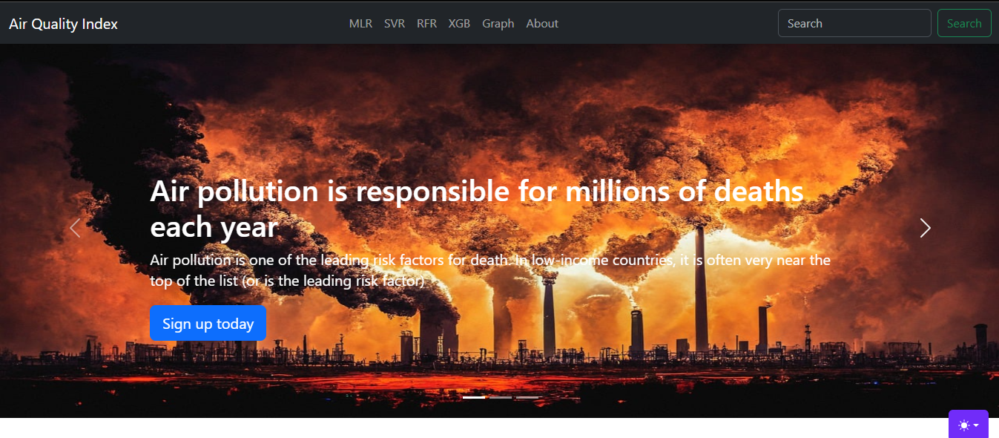

[Air Quality Index](http://airqualityprediction.pythonanywhere.com/)
This project is an end to end data science project that is able to predict the chances of getting a disease in organs like liver, kidey, heart, etc.  

# Dataset Used
 [Diabetes](https://www.kaggle.com/datasets/rohanrao/air-quality-data-in-india): Air Quality Data in India (2015 - 2020)

# Libraries Used:
 1. Django
 2. Sci-kit Learn
 3. xgboost
 4. Joblib
 5. Pandas
 6. Numpy
 7. Bootstrap
 8. HTML & CSS
 
 This whole Project is Deployed over <u>pythonanywhere.com Python</u>
 
 # Steps used for Deployment:
 a. Created the ML model and saved it using joblib. 
 b. Created Django project. 
 c. Created app for each Disease. 
 d. Similarly Deployed all models and connected them to the each app page inside  web server. 
 
 # Project Created by:
[Shahab Afridy](https://www.linkedin.com/in/shahab-afridy-230577207?utm_source=share&utm_campaign=share_via&utm_content=profile&utm_medium=android_app)
